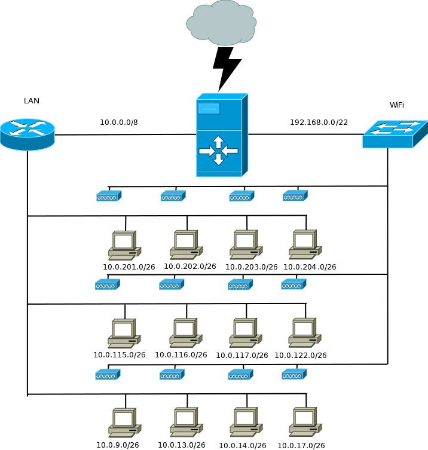

# Zadanie 2

## Projekt sieci lokalnej dla jednostki dydaktycznej uniwersytetu


### Cel Projektu
  Zaprojektowanie i weryfikacja działania sieci w środowisku testowym. 
  Rozwiązanie zapewnia dostęp do internetu dla wszystkich urządzeńw infrastrukturze.
  
### Założenia projektu

* Sieć zlokalizowana jest w budynku 3 kondygnacyjnym
* Na kążdej z kondygnacji znajdują się laboratoria komputerowe kolejno:
  * poziom 0 
    * 009, 013, 014
  * poziom 1
    * 115, 116, 117, 122
  * poziom 2
    * 201, 202, 203 
* Każde z laboratoriów wyposażone jest w 35 stanowisk dla uczestników kursów
* Jednostka planuje otworzenie kolejnych laboratoriów 017 oraz 204
* Każda kondygnacja wyposażona jest w izolowaną sieć Wi-Fi, udostępniajacą sieć internet podłączonym gościom
  * Sieć Wi-Fi nie pozwala na bezposrednią komunikację z urządzeniami zlokalizowanymi w pozostałej części sieci,
    tj: laboratoria, serwery jednostki
  * Prognozowana maksymalna liczba jednoczesnych urządzeń podłączonych do sieci to ``800``
* Jednostka posiada przyłącze internetowe oraz dysponuje pulą adresów ``188.156.220.160/27``
* Jednostka posiada serwery udostępniajace zasoby do celów dydaktycznych i promocyjnych
  * serwery zlokalizowane są w osobnym pomieszczeniu
  * udostępniają zasoby w sieci publicznej z wykorzystaniem sieci ``188.156.220.160/27``
  * Jeden serwer pełni rolę bramy dla urządzań w sieci lokalnej ``LAN``

### Wstępne założenia

* Każde laboratorium posiada oddzielną podsieć pozwalającą efektywnie zidentyfikować urządzania
  * kondygnacja oraz sala
* Dla uniknięcia zbyt słabego zasięgu sieć WiFi zostanie wyposażona w 4 urządzenia nadawcze na każdej kondygnacji
 

#### zadanie - wymaganai

* Dokonaj podziału i projektu sieci w formie dokumentu w formacie ``MARKDOW`` zawierającego specyfikację tekstową oraz obrazkową
  projektowanej sieci
* Przygotuj prototyp rozwiązania z wykorzystaniem oprogramowania ``VirtualBox`` lub podobnego.
* W specyfikacji uwzględnij wielkości sieci oraz ich adresy
* W specyfikacji uwzględnij konfigurację tablicy routingu
* Dokumentację graficzną stworzonej architektury przygotuj w programie ``DIA`` lub podobnym
---
# Rozwiązanie
Sieć WiFi ma pomieścić 800 urządzeń, dlatego korzystam z maski `/22`. 

Tworzę sieć ```192.168.0.0/22``` na jej potrzebę

Dla sieci lan wybieram pulę adresów prywatnych klasy A aby z łatwością używać adresów odpowiadających nazwom sal.

Tworzę sieć ```10.0.0.0/8```

Dla poszczególnych laboratoriów komputerowych tworzę sieci z połączeniem kondygnacji i numeru sali w trzecim oktecie adresu.

W ten sposób powstają sieci:

## Poziom 0:
- Lab09: ```10.0.9.0/26```
- Lab13: ```10.0.13.0/26```
- Lab14: ```10.0.14.0/26```
- Lab17: ```10.0.17.0/26```

## Poziom 1:
- Lab115: ```10.0.115.0/26```
- Lab116: ```10.0.116.0/26```
- Lab117: ```10.0.117.0/26```
- Lab122: ```10.0.122.0/26```

## Poziom 2:
- Lab201: ```10.0.201.0/26```
- Lab202: ```10.0.202.0/26```
- Lab203: ```10.0.203.0/26```
- Lab204: ```10.0.204.0/26```

# Potrzebne polecenia:

- ```ip addr add {} dev {}```
- ```ip route add default via {} ```
- IP forwarding w pliku ```/etc/sysctl.conf``` / ```echo 1 > /proc/sys/net/ipv4/ip_forward```
- Masquerade ```iptables --table nat --append POSTROUTING --out-interface {} -j MASQUERADE``` / ``iptables --append FORWARD --in-interface {} -j ACCEPT``
- ustawienie DHCP dla routera WiFi. ```apt-get install isc-dhcp-server``` oraz ```systemctl start isc-dhcp-server```
- konfiguracja pliku ```/etc/dhcp/dhcpd.conf```


# Diagram:


