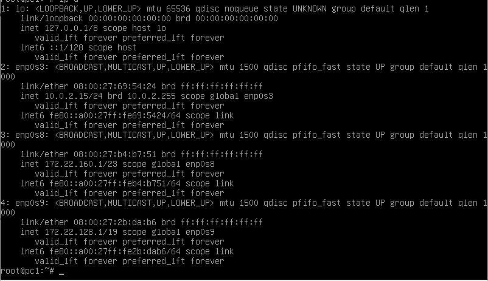
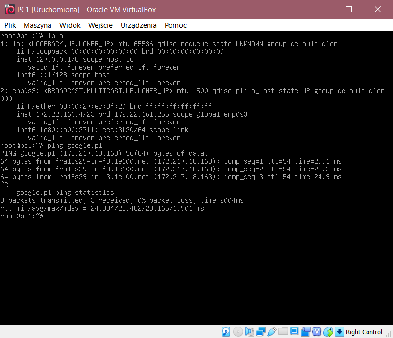
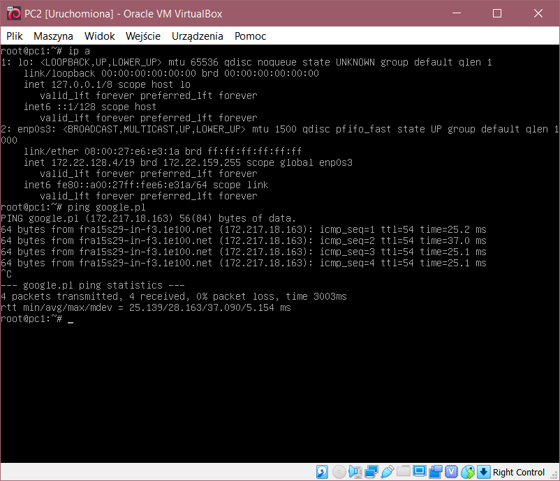

# Podsieci:
Sieć ```172.22.128.0/17``` należy podzielić na dwie podsieci ```LAN1``` mieszczącą 500 hostów oraz ```LAN2``` mieszczącą 5000 hostów.

Wyliczam maskę dla większej podsieci: potrzebna będzie maska /19 dająca nam 8192 hosty (/20 byłaby niewystarczająca ponieważ mieści jedynie 4094 hosty).

Adres podsieci ```LAN1```: ```172.22.128.0/19``` z adresem rozgłoszeniowym ```172.22.159.255```

Adres podsieci ```LAN2```: ```172.22.160.0/23``` z adresem rozgłoszeniowym ```172.22.161.255```

---

# Konfiguracja:

## Sieć NAT LAN1:


## Sieć NAT LAN2:


## PC0: 


## PC1:


## PC2:


### Użyte polecenia:
- ip addr add
- echo 1 > /proc/sys/net/ipv4/ip_forward
- iptables --table nat --append POSTROUTING --out-interface 10.0.2.15 -j MASQUERADE
- iptables --append FORWARD --in-interface 172.22.160.1 -j ACCEPT

---
# Diagram:

